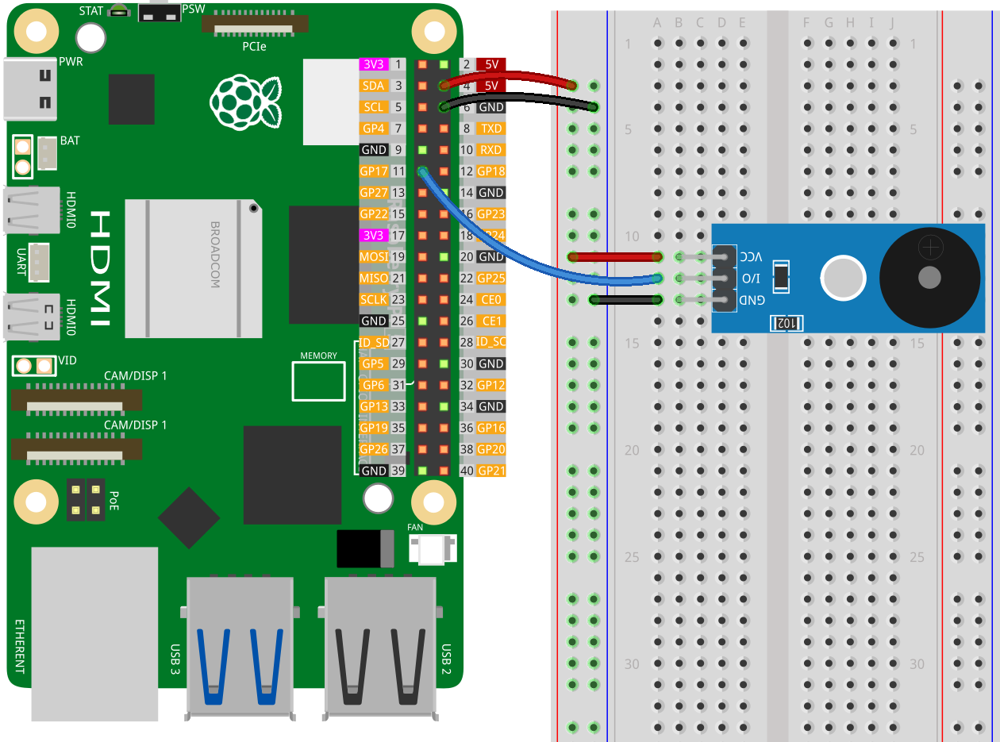

.. note::

    こんにちは、SunFounder Raspberry Pi & Arduino & ESP32 Enthusiasts Communityへようこそ！Facebook上で、仲間と一緒にRaspberry Pi、Arduino、ESP32をさらに深く探求しましょう。

    **なぜ参加するのか？**

    - **専門的なサポート**：購入後の問題や技術的な課題をコミュニティやチームの助けを借りて解決。
    - **学びと共有**：スキルを向上させるためのヒントやチュートリアルを交換。
    - **限定プレビュー**：新製品発表や予告編に早期アクセス。
    - **特別割引**：最新製品の特別割引を楽しむ。
    - **フェスティブプロモーションとプレゼント**：プレゼントやホリデープロモーションに参加。

    👉 私たちと一緒に探索と創造を始める準備はできましたか？[|link_sf_facebook|]をクリックして、今すぐ参加しましょう！

.. _pi_lesson32_passive_buzzer:

Lesson 32: Passive Buzzer Module
==================================

In this lesson, you will learn how to create musical tones using a TonalBuzzer with a Raspberry Pi. You'll learn how to program the Raspberry Pi to play a sequence of musical notes using Python. The lesson includes defining a tune as a list of notes and durations, and writing a function to play these notes through the buzzer. This project offers a straightforward introduction to working with sound output and Python programming, making it a practical choice for beginners interested in exploring musical applications with the Raspberry Pi.

Required Components
--------------------------

In this project, we need the following components. 

It's definitely convenient to buy a whole kit, here's the link: 

.. list-table::
    :widths: 20 20 20
    :header-rows: 1

    *   - Name	
        - ITEMS IN THIS KIT
        - LINK
    *   - Universal Maker Sensor Kit
        - 94
        - |link_umsk|

You can also buy them separately from the links below.

.. list-table::
    :widths: 30 20
    :header-rows: 1

    *   - Component Introduction
        - Purchase Link

    *   - Raspberry Pi 5
        - \-
    *   - :ref:`cpn_buzzer`
        - |link_passive_buzzer_module_buy|
    *   - :ref:`cpn_breadboard`
        - |link_breadboard_buy|
        

Wiring
---------------------------

Code
---------------------------

.. code-block:: python

   from gpiozero import TonalBuzzer
   from time import sleep

   # Initialize the TonalBuzzer on GPIO pin 17
   tb = TonalBuzzer(17)  # Change to the pin number your buzzer is connected to

   def play(tune):
      """
      Play a musical tune using the buzzer.
      :param tune: List of tuples, where each tuple contains a note and its duration.
      """
      for note, duration in tune:
         print(note)  # Print the current note being played
         tb.play(note)  # Play the note on the buzzer
         sleep(float(duration))  # Wait for the duration of the note
      tb.stop()  # Stop the buzzer after playing the tune

   # Define the musical tune as a list of notes and their durations
   tune = [('C#4', 0.2), ('D4', 0.2), (None, 0.2),
      ('Eb4', 0.2), ('E4', 0.2), (None, 0.6),
      ('F#4', 0.2), ('G4', 0.2), (None, 0.6),
      ('Eb4', 0.2), ('E4', 0.2), (None, 0.2),
      ('F#4', 0.2), ('G4', 0.2), (None, 0.2),
      ('C4', 0.2), ('B4', 0.2), (None, 0.2),
      ('F#4', 0.2), ('G4', 0.2), (None, 0.2),
      ('B4', 0.2), ('Bb4', 0.5), (None, 0.6),
      ('A4', 0.2), ('G4', 0.2), ('E4', 0.2),
      ('D4', 0.2), ('E4', 0.2)]

   # Play the tune
   play(tune) 

Code Analysis
---------------------------

#. Import Libraries
   
   Import ``TonalBuzzer`` from ``gpiozero`` for sound generation and ``sleep`` from ``time`` for timing control.

   .. code-block:: python

      from gpiozero import TonalBuzzer
      from time import sleep

#. Initialize the TonalBuzzer
   
   Create a ``TonalBuzzer`` object connected to GPIO pin 17.

   .. code-block:: python

      tb = TonalBuzzer(17)

#. Define the Play Function
   
   The ``play`` function takes a list of tuples as input, where each tuple represents a musical note and its duration. It iterates through each tuple, playing the note and waiting for its duration.

   .. code-block:: python

      def play(tune):
          for note, duration in tune:
              print(note)
              tb.play(note)
              sleep(float(duration))
          tb.stop()

#. Define the Musical Tune
   
   The tune is defined as a list of tuples. Each tuple contains a note and its duration in seconds. ``None`` is used to represent a pause.

   .. code-block:: python

      tune = [('C#4', 0.2), ('D4', 0.2), (None, 0.2), ...]

#. Play the Tune
   
   The ``play`` function is called with the ``tune`` list, causing the buzzer to play the defined sequence of notes.

   .. code-block:: python

      play(tune) 