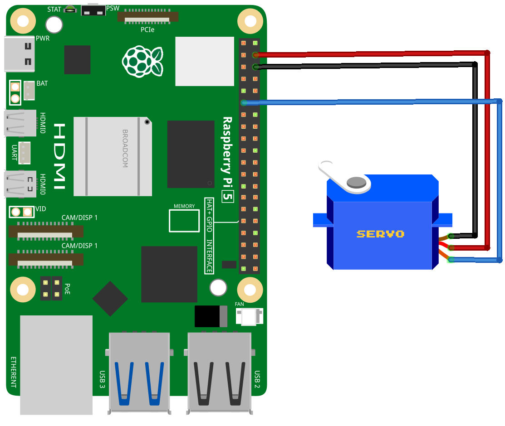

.. note::

   Hallo und willkommen in der SunFounder Raspberry Pi & Arduino & ESP32 Enthusiasten-Gemeinschaft auf Facebook! Tauchen Sie tiefer ein in die Welt von Raspberry Pi, Arduino und ESP32 mit anderen Enthusiasten.

   **Warum beitreten?**

   - **Expertenunterstützung**: Lösen Sie Nachverkaufsprobleme und technische Herausforderungen mit Hilfe unserer Gemeinschaft und unseres Teams.
   - **Lernen & Teilen**: Tauschen Sie Tipps und Anleitungen aus, um Ihre Fähigkeiten zu verbessern.
   - **Exklusive Vorschauen**: Erhalten Sie frühzeitigen Zugang zu neuen Produktankündigungen und exklusiven Einblicken.
   - **Spezialrabatte**: Genießen Sie exklusive Rabatte auf unsere neuesten Produkte.
   - **Festliche Aktionen und Gewinnspiele**: Nehmen Sie an Gewinnspielen und Feiertagsaktionen teil.

   👉 Sind Sie bereit, mit uns zu erkunden und zu erschaffen? Klicken Sie auf [|link_sf_facebook|] und treten Sie heute bei!

.. _pi_lesson33_servo:

Lesson 33: Servo Motor (SG90)
==================================

In dieser Lektion lernst du, wie du einen Servomotor mit einem Raspberry Pi steuerst. Du wirst lernen, wie man die Pulslängen des Servos für präzise Steuerung anpasst und ein Python-Skript schreibt, um den Servo in verschiedene Positionen zu bewegen: Minimum, Mitte und Maximum.

Benötigte Komponenten
--------------------------

Für dieses Projekt benötigen wir die folgenden Komponenten. 

Es ist definitiv praktisch, ein komplettes Kit zu kaufen, hier ist der Link: 

.. list-table::
    :widths: 20 20 20
    :header-rows: 1

    *   - Name	
        - ITEMS IN THIS KIT
        - LINK
    *   - Universal Maker Sensor Kit
        - 94
        - |link_umsk|

Du kannst sie auch separat über die untenstehenden Links kaufen.

.. list-table::
    :widths: 30 20
    :header-rows: 1

    *   - Component Introduction
        - Purchase Link

    *   - Raspberry Pi 5
        - \-
    *   - :ref:`cpn_servo`
        - |link_servo_buy|

Verkabelung
---------------------------

Code
---------------------------

.. code-block:: python

   from gpiozero import Servo
   from time import sleep
   
   # GPIO pin for the servo
   myGPIO = 17
   
   # Correction factor for the servo
   myCorrection = 0.45
   maxPW = (2.0 + myCorrection) / 1000  # Maximum pulse width
   minPW = (1.0 - myCorrection) / 1000  # Minimum pulse width
   
   # Initialize the servo with adjusted pulse width range
   servo = Servo(myGPIO, min_pulse_width=minPW, max_pulse_width=maxPW)
   
   # Continuously move servo between positions
   while True:
      # Move servo to middle position
      servo.mid()
      print("mid")
      sleep(0.5)

      # Move servo to minimum position
      servo.min()
      print("min")
      sleep(1)

      # Move servo to middle position
      servo.mid()
      print("mid")
      sleep(0.5)

      # Move servo to maximum position
      servo.max()
      print("max")
      sleep(1)

Code-Analyse
---------------------------

#. Bibliotheken importieren
   
   Importiere die Klasse ``Servo`` aus der Bibliothek ``gpiozero`` zur Steuerung des Servos und ``sleep`` aus der Bibliothek ``time`` für Zeitverzögerungen.

   .. code-block:: python

      from gpiozero import Servo
      from time import sleep

#. GPIO-Pin und Servokorrekturfaktor
   
   Definiere den GPIO-Pin, der mit dem Servo verbunden ist, und setze einen Korrekturfaktor, um den Pulslängenbereich des Servos zu kalibrieren.

   .. code-block:: python

      myGPIO = 17
      myCorrection = 0.45
      maxPW = (2.0 + myCorrection) / 1000
      minPW = (1.0 - myCorrection) / 1000

#. Initialisiere den Servo
   
   Erstelle ein ``Servo``-Objekt mit dem angegebenen GPIO-Pin und dem angepassten Pulslängenbereich.

   .. code-block:: python

      servo = Servo(myGPIO, min_pulse_width=minPW, max_pulse_width=maxPW)

#. Bewege den Servo kontinuierlich
   
   Verwende eine ``while True``-Schleife, um den Servo zwischen seinen Minimal-, Mittel- und Maximalpositionen zu bewegen, die aktuelle Position zu drucken und zwischen den Bewegungen zu pausieren.

   .. code-block:: python

      while True:
          servo.mid()
          print("mid")
          sleep(0.5)

          servo.min()
          print("min")
          sleep(1)

          servo.mid()
          print("mid")
          sleep(0.5)

          servo.max()
          print("max")
          sleep(1)