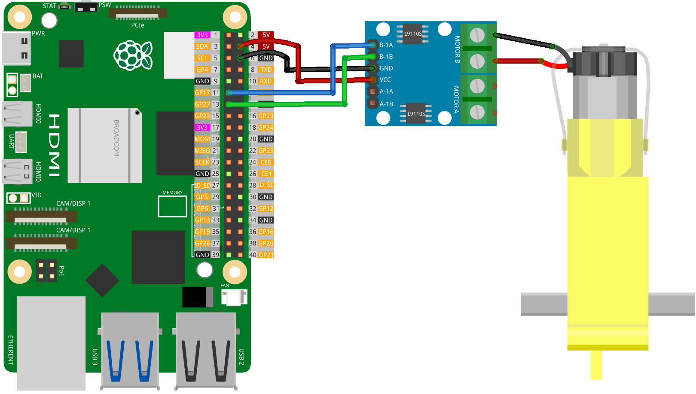

.. note::

   Hallo und willkommen in der SunFounder Raspberry Pi & Arduino & ESP32 Enthusiasten-Gemeinschaft auf Facebook! Tauchen Sie tiefer ein in die Welt von Raspberry Pi, Arduino und ESP32 mit anderen Enthusiasten.

   **Warum beitreten?**

   - **Expertenunterstützung**: Lösen Sie Nachverkaufsprobleme und technische Herausforderungen mit Hilfe unserer Gemeinschaft und unseres Teams.
   - **Lernen & Teilen**: Tauschen Sie Tipps und Anleitungen aus, um Ihre Fähigkeiten zu verbessern.
   - **Exklusive Vorschauen**: Erhalten Sie frühzeitigen Zugang zu neuen Produktankündigungen und exklusiven Einblicken.
   - **Spezialrabatte**: Genießen Sie exklusive Rabatte auf unsere neuesten Produkte.
   - **Festliche Aktionen und Gewinnspiele**: Nehmen Sie an Gewinnspielen und Feiertagsaktionen teil.

   👉 Sind Sie bereit, mit uns zu erkunden und zu erschaffen? Klicken Sie auf [|link_sf_facebook|] und treten Sie heute bei!

.. _pi_lesson34_motor:

Lektion 34: TT Motor
==========================

In dieser Lektion lernen Sie, wie man die Geschwindigkeit und Richtung eines Motors mit einem Raspberry Pi steuert. Sie lernen, wie man den Raspberry Pi programmiert, um den Motor mit unterschiedlichen Geschwindigkeiten sowohl vorwärts als auch rückwärts laufen zu lassen. Das Projekt umfasst das Einstellen der Motorgeschwindigkeit, das Laufenlassen für eine bestimmte Dauer und das anschließende Stoppen. Diese Übung bietet eine praktische Einführung in die Motorsteuerung mit dem Raspberry Pi und bietet eine klare und einfache Erfahrung in der Hardwaresteuerung und Python-Programmierung, die sich für Anfänger eignet.

Benötigte Komponenten
------------------------

Für dieses Projekt benötigen wir die folgenden Komponenten. 

Es ist auf jeden Fall praktisch, ein ganzes Kit zu kaufen. Hier ist der Link:

.. list-table::
    :widths: 20 20 20
    :header-rows: 1

    *   - Name	
        - ITEMS IN THIS KIT
        - LINK
    *   - Universal Maker Sensor Kit
        - 94
        - |link_umsk|

Sie können sie auch separat über die untenstehenden Links kaufen.

.. list-table::
    :widths: 30 20
    :header-rows: 1

    *   - Component Introduction
        - Purchase Link

    *   - Raspberry Pi 5
        - \-
    *   - :ref:`cpn_ttmotor`
        - \-
    *   - :ref:`cpn_l9110`
        - \-

Verkabelung
-----------

Code
---------------------------

.. code-block:: python

   from gpiozero import Motor
   from time import sleep

   # Define motor pins
   motor = Motor(forward=17, backward=27)  # Using Raspberry Pi GPIO pin numbers

   # Run the motor forward at half speed
   motor.forward(speed=0.5)  # Set motor speed, range is 0 to 1
   sleep(5)                  # Run the motor for 5 seconds

   # Increase to full speed forward
   motor.forward(speed=1)    # Set motor speed, range is 0 to 1
   sleep(5)                  # Run the motor for 5 seconds

   # Run the motor backward at full speed
   motor.backward(speed=1)   # Set motor speed, range is 0 to 1
   sleep(5)                  # Run the motor for 5 seconds

   # Stop the motor
   motor.stop()

Code-Analyse
---------------------------

#. Bibliotheken importieren
   
   Importieren Sie die Klasse ``Motor`` aus ``gpiozero`` zur Motorsteuerung und ``sleep`` aus ``time`` zur Zeitsteuerung.

   .. code-block:: python

      from gpiozero import Motor
      from time import sleep

#. Motor-Pins definieren
   
   Erstellen Sie ein ``Motor``-Objekt, um einen Motor zu steuern, der an die GPIO-Pins 17 und 27 für Vorwärts- und Rückwärtsbewegungen angeschlossen ist.

   .. code-block:: python

      motor = Motor(forward=17, backward=27)

#. Motor mit halber Geschwindigkeit vorwärts laufen lassen
   
   Der Motor wird mit halber Geschwindigkeit (``speed=0.5``) für 5 Sekunden vorwärts betrieben. Der Geschwindigkeitsbereich liegt zwischen 0 (aus) und 1 (volle Geschwindigkeit).

   .. code-block:: python

      motor.forward(speed=0.5)
      sleep(5)

#. Erhöhen der Geschwindigkeit auf volle Geschwindigkeit vorwärts
   
   Erhöhen Sie die Motorgeschwindigkeit auf volle Geschwindigkeit (``speed=1``) in Vorwärtsrichtung und betreiben Sie ihn weitere 5 Sekunden.

   .. code-block:: python

      motor.forward(speed=1)
      sleep(5)

#. Motor mit voller Geschwindigkeit rückwärts laufen lassen
   
   Der Motor wird dann 5 Sekunden lang mit voller Geschwindigkeit rückwärts betrieben.

   .. code-block:: python

      motor.backward(speed=1)
      sleep(5)

#. Motor stoppen
   
   Schließlich stoppen Sie den Motor mit der Methode ``stop``.

   .. code-block:: python

      motor.stop()

