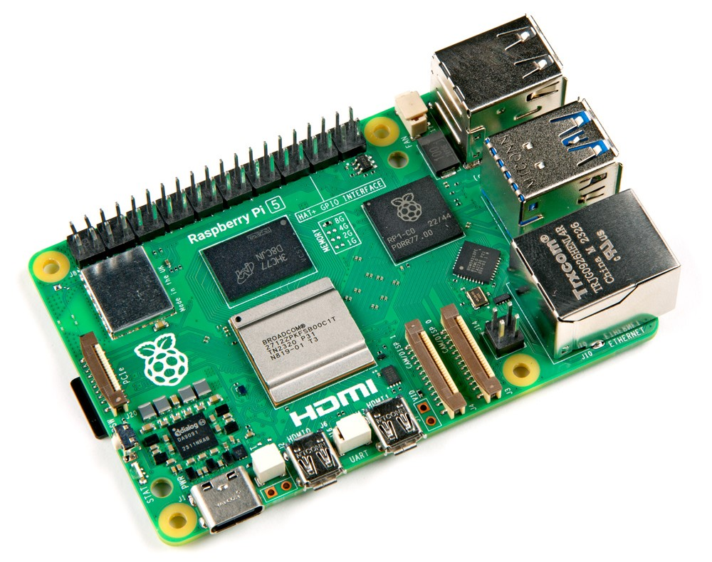

 
 .. note::

    Hallo und willkommen in der SunFounder Raspberry Pi & Arduino & ESP32 Enthusiasten-Gemeinschaft auf Facebook! Tauchen Sie tiefer ein in die Welt von Raspberry Pi, Arduino und ESP32 mit anderen Enthusiasten.

    **Warum beitreten?**

    - **Expertenunterstützung**: Lösen Sie Nachverkaufsprobleme und technische Herausforderungen mit Hilfe unserer Gemeinschaft und unseres Teams.
    - **Lernen & Teilen**: Tauschen Sie Tipps und Anleitungen aus, um Ihre Fähigkeiten zu verbessern.
    - **Exklusive Vorschauen**: Erhalten Sie frühzeitigen Zugang zu neuen Produktankündigungen und exklusiven Einblicken.
    - **Spezialrabatte**: Genießen Sie exklusive Rabatte auf unsere neuesten Produkte.
    - **Festliche Aktionen und Gewinnspiele**: Nehmen Sie an Gewinnspielen und Feiertagsaktionen teil.

    👉 Sind Sie bereit, mit uns zu erkunden und zu erschaffen? Klicken Sie auf [|link_sf_facebook|] und treten Sie heute bei!

.. _what_do_we_need:

Was brauchen wir?
====================

Benötigte Komponenten
--------------------------

**Raspberry Pi**

Der Raspberry Pi ist ein kostengünstiger, kreditkartengroßer Computer, der an einen Computermonitor oder Fernseher angeschlossen und mit einer Standardtastatur und -maus verwendet wird. Es handelt sich um ein vielseitiges Gerät, das Menschen jeden Alters ermöglicht, sich mit Computern zu beschäftigen und Programmiersprachen wie Scratch und Python zu erlernen.

**Netzteil**

.. https://www.tablesgenerator.com/text_tables

+-----------------------------+--------------------------------------------------+
| Model                       | Empfohlene Stromversorgung (Spannung/Strom)      |
+=============================+==================================================+
| Raspberry Pi 5              | 5V/5A, 5V/3A begrenzt Peripheriegeräte auf 600mA |
+-----------------------------+--------------------------------------------------+
| Raspberry Pi 4 Model B      | 5V/3A                                            |
+-----------------------------+--------------------------------------------------+
| Raspberry Pi 3 (alle Modelle)| 5V/2.5A                                         |
+-----------------------------+--------------------------------------------------+

**Micro-SD-Karte**

Ihr Raspberry Pi benötigt eine Micro-SD-Karte, um alle seine Dateien und das Raspberry Pi-Betriebssystem zu speichern. Sie benötigen eine Micro-SD-Karte mit einer Kapazität von mindestens 8 GB.

Optionale Komponenten
-------------------------

**Bildschirm**

Um auf die Desktop-Umgebung des Raspberry Pi zugreifen zu können, können Sie ihn mit einem Fernseher oder einem Computermonitor verbinden. Wenn der Bildschirm Lautsprecher enthält, wird der Ton über diese ausgegeben.

**Maus & Tastatur**

Wenn Sie einen Bildschirm verwenden, werden auch eine USB-Tastatur und eine USB-Maus benötigt.

**HDMI**

Der Raspberry Pi verfügt über HDMI- (oder Micro-HDMI-) Ausgangsanschlüsse, die mit den HDMI-Anschlüssen der meisten modernen Fernseher und Computermonitore kompatibel sind. Wenn Ihr Bildschirm nur über einen DVI- oder VGA-Anschluss verfügt, müssen Sie das entsprechende Adapterkabel verwenden.

**Gehäuse**

Sie können den Raspberry Pi in ein Gehäuse legen, um Ihr Gerät zu schützen. Auf unserer offiziellen Website bieten wir entsprechende Produkte zum Verkauf an; Sie können Raspberry Pi-Gehäuse anzeigen oder kaufen |link_buy_pi_case|.

**Sound oder Kopfhörer**

Die meisten Raspberry Pi-Modelle verfügen über einen 3,5-mm-Audiosteckplatz, der verwendet werden kann, wenn Ihr Bildschirm keine integrierten Lautsprecher hat oder nicht verwendet wird. Es ist jedoch wichtig zu beachten, dass der neueste Raspberry Pi 5 keinen 3,5-mm-Audiosteckplatz hat.

