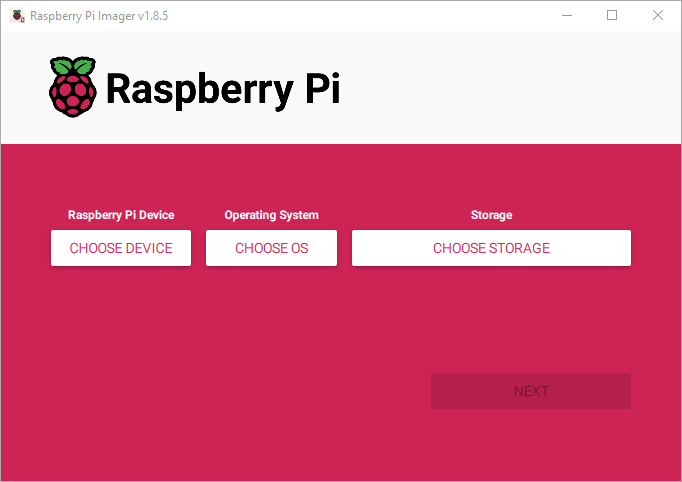
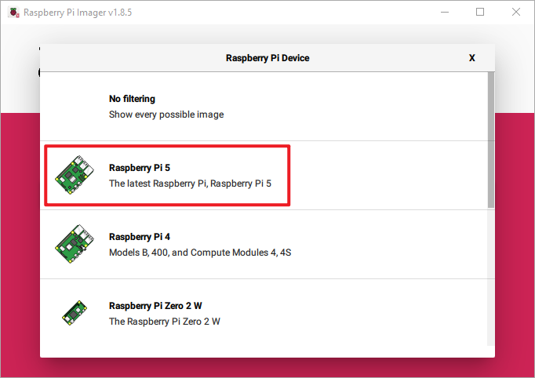
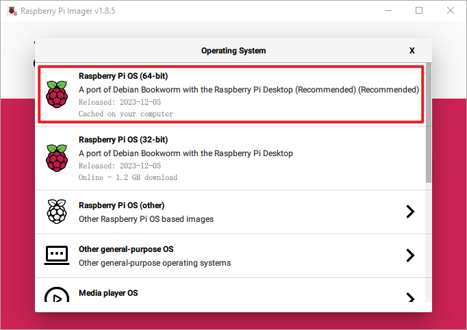
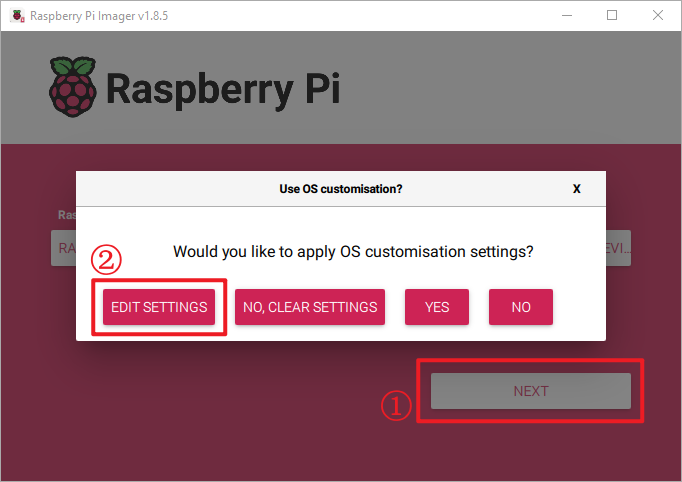
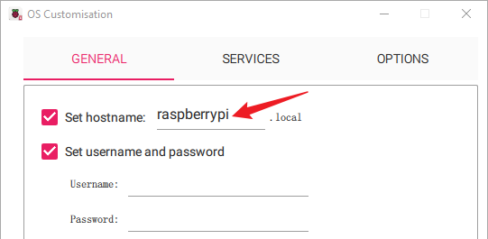
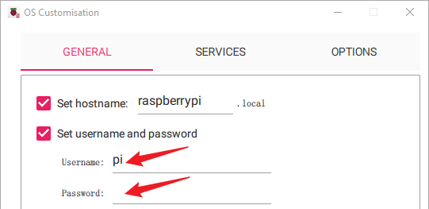
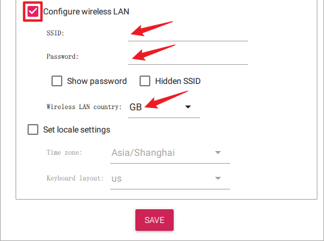
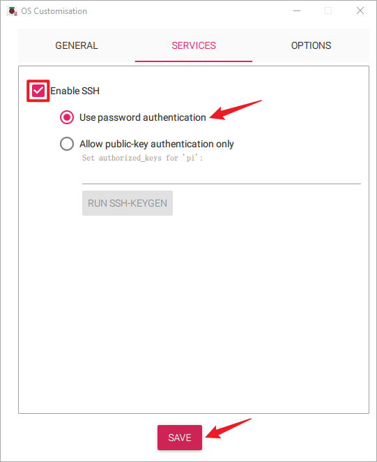
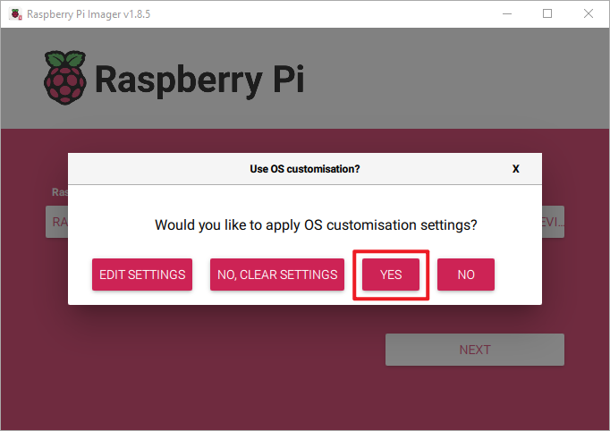
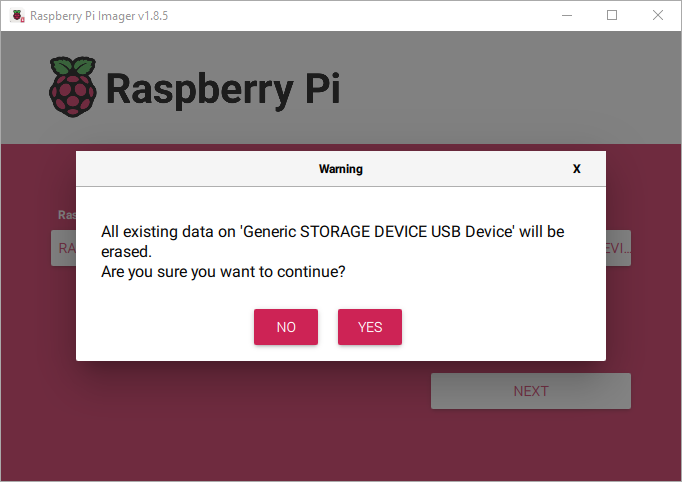

.. note::

    Hello, welcome to the SunFounder Raspberry Pi & Arduino & ESP32 Enthusiasts Community on Facebook! Dive deeper into Raspberry Pi, Arduino, and ESP32 with fellow enthusiasts.

    **Why Join?**

    - **Expert Support**: Solve post-sale issues and technical challenges with help from our community and team.
    - **Learn & Share**: Exchange tips and tutorials to enhance your skills.
    - **Exclusive Previews**: Get early access to new product announcements and sneak peeks.
    - **Special Discounts**: Enjoy exclusive discounts on our newest products.
    - **Festive Promotions and Giveaways**: Take part in giveaways and holiday promotions.

    👉 Ready to explore and create with us? Click [|link_sf_facebook|] and join today!

.. _install_os:

Write Raspberry Pi OS to SD Card
========================================

**Step 1**

The Raspberry Pi team offers a user-friendly graphical SD card writing tool compatible with Mac OS, Ubuntu 18.04, and Windows. This is the most convenient option for most users, as it automatically downloads and installs the OS image to the SD card.

Visit the download page: https://www.raspberrypi.org/software/. Choose the **Raspberry Pi Imager** for your operating system. Once downloaded, open it to begin the installation.

.. image:: img/installing_01.png
    :align: center

.. raw:: html

     

**Step 2**

Upon launching the installer, your OS might prompt a security warning. For instance, Windows may show this message:

.. image:: img/installing_02.png
    :align: center

.. raw:: html

     

If you see this warning, click on **More info** and then choose **Run anyway**. Continue by following the instructions on your screen to complete the installation of the Raspberry Pi Imager.

**Step 3**

After installing the Imager, open the application by clicking the **Raspberry Pi Imager** icon or executing ``rpi-imager``.

.. raw:: html

     

**Step 4**

Click **Choose device** and select your Raspberry Pi model from the list.

.. raw:: html

     

**Step 5**

Next, click **Choose OS** and pick an operating system to install. 

.. raw:: html

     

**Step 6**

Insert your preferred storage medium, such as a microSD card, into an external or integrated SD card reader. Next, click "Choose Storage" and select your device.

.. note:: 

   **Ensure you select the correct storage device when multiple devices are connected**; they can often be distinguished by their capacity. If uncertain, disconnect the other devices. **Be aware that installing the system on the chosen storage device will erase all data on it.**

.. image:: img/installing_06.png
    :align: center

.. raw:: html

     

**Step 7**

Press the **NEXT** button and choose **EDIT SETTINGS** to access the OS Customization page.

.. raw:: html

     

**Step 8**

Set the **hostname**.

.. note::

   The hostname option defines the hostname your Raspberry Pi broadcasts to the network using mDNS. By connecting your Raspberry Pi to the network, it allows other devices to interact with it using ``<hostname>.local`` or ``<hostname>.lan``.

.. raw:: html

     

Set the **username** and **password** for the Raspberry Pi's administrator account.

.. note::
   The Raspberry Pi does not come with a default password, making it crucial to set one. Additionally, you have the option to personalize the username.

.. raw:: html

     

Configure wireless LAN by entering your network's **SSID** and **password**.

.. note::

   Configure the "Wireless LAN country" using your nation's two-letter |link_alpha2_code|.

.. raw:: html

     

**Step 9**

Navigate to the **SERVICES** page, choose **Enable SSH option** to turn on SSH, and select “Use password authentication” (recommended for beginners). Click **Save** to apply your changes.

.. raw:: html

     

**Step 10**

Click the **Yes** button.

.. raw:: html

     

**Step 11**

If your SD card contains files, consider backing them up to avoid permanent loss. If no backup is needed, click **Yes**.

.. raw:: html

     

**Step 12**

The window below will appear once the writing process is complete. Writing process takes some time and varies based on the SD card's read-write performance; please be patient.

.. image:: img/installing_14.png
    :align: center

.. raw:: html

     

