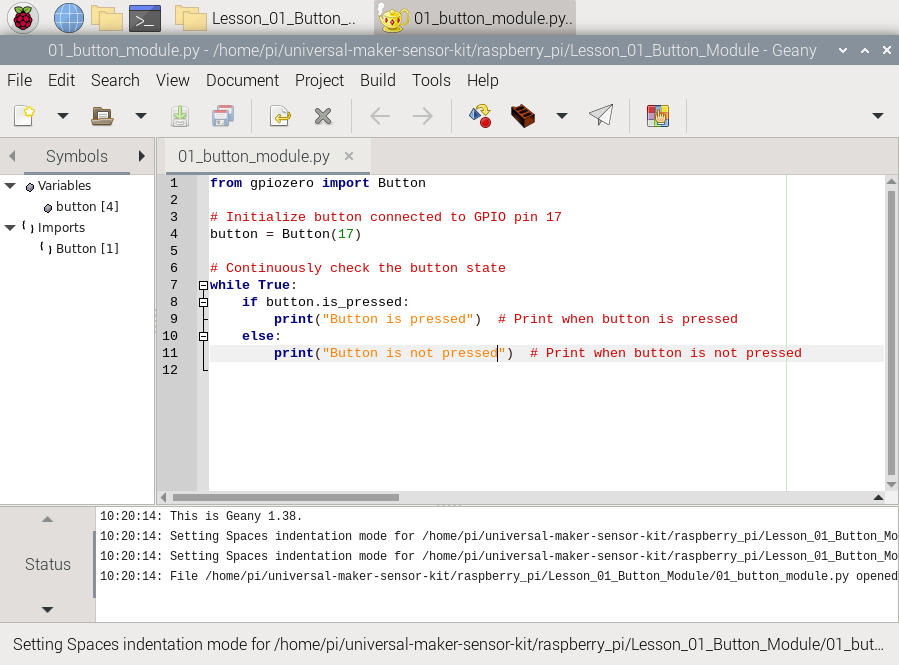

 .. note::

    Hallo und willkommen in der SunFounder Raspberry Pi & Arduino & ESP32 Enthusiasten-Gemeinschaft auf Facebook! Tauchen Sie tiefer ein in die Welt von Raspberry Pi, Arduino und ESP32 mit anderen Enthusiasten.

    **Warum beitreten?**

    - **Expertenunterstützung**: Lösen Sie Nachverkaufsprobleme und technische Herausforderungen mit Hilfe unserer Gemeinschaft und unseres Teams.
    - **Lernen & Teilen**: Tauschen Sie Tipps und Anleitungen aus, um Ihre Fähigkeiten zu verbessern.
    - **Exklusive Vorschauen**: Erhalten Sie frühzeitigen Zugang zu neuen Produktankündigungen und exklusiven Einblicken.
    - **Spezialrabatte**: Genießen Sie exklusive Rabatte auf unsere neuesten Produkte.
    - **Festliche Aktionen und Gewinnspiele**: Nehmen Sie an Gewinnspielen und Feiertagsaktionen teil.

    👉 Sind Sie bereit, mit uns zu erkunden und zu erschaffen? Klicken Sie auf [|link_sf_facebook|] und treten Sie heute bei!

 
So laden Sie den Code herunter und führen ihn aus
=====================================================

Code auf Ihren Raspberry Pi herunterladen
-------------------------------------------

Bevor Sie den Code herunterladen, beachten Sie bitte, dass der Beispielcode **NUR** auf der neuesten Version des **Raspberry Pi OS** getestet wurde. Wir bieten zwei Download-Methoden an:

Wenn Sie nicht direkt über einen Bildschirm auf Ihren Raspberry Pi zugreifen, sollten Sie die Optionen für den Fernzugriff in Betracht ziehen. Für detaillierte Anleitungen siehe die Anweisungen unter :ref:`no_screen`.

**Methode 1: Mit Git Clone (Empfohlen)**

1. Melden Sie sich auf Ihrem Raspberry Pi an, öffnen Sie das Terminal und navigieren Sie zum Home-Verzeichnis (``~``). (Sie können auch auf das Terminal über SSH zugreifen.)

   .. code-block:: bash

      cd ~

   .. image:: img/quick_guide_01.png
       :width: 100%

   .. note::

      Verwenden Sie den ``cd``-Befehl, um das Verzeichnis zu wechseln. Hier steht ``~/`` für das Home-Verzeichnis.

2. Klonen Sie das GitHub-Repository.

   .. code-block:: bash

      git clone https://github.com/sunfounder/universal-maker-sensor-kit.git

   .. image:: img/quick_guide_02.png
       :width: 100%
   
   .. raw:: html

        

3. Verwenden Sie den Dateimanager, um auf die heruntergeladenen Code-Dateien zuzugreifen.

   .. image:: img/quick_guide_03.png
       :width: 100%

**Methode 2: Herunterladen des Codes direkt von GitHub**

1. Öffnen Sie einen Webbrowser und gehen Sie zu https://github.com/sunfounder/universal-maker-sensor-kit, klicken Sie dann auf die Schaltfläche zum Herunterladen.

   .. image:: img/quick_guide_04.png

2. Sobald der Download abgeschlossen ist, suchen Sie die Code-Datei im Verzeichnis ``File Manager > Downloads`` und entpacken Sie sie in das Verzeichnis ``/home/pi``.

   .. image:: img/quick_guide_05.png

3. Navigieren Sie zum Verzeichnis ``/home/pi``, um auf die extrahierten Code-Dateien zuzugreifen.

   .. image:: img/quick_guide_06.png

Öffnen und Ausführen des Codes
-------------------------------

Den Code für jedes Projekt finden Sie im entsprechenden Code-Abschnitt. Alternativ können Sie den Code im bereitgestellten Code-Verzeichnis finden. Zum Beispiel finden Sie im Verzeichnis ``universal-maker-sensor-kit/raspberry_pi/`` den Code für Lektion 1 mit dem Namen ``01_button_module.py``.

Es gibt zwei Möglichkeiten, Python-Code auszuführen：

**Methode 1: Mit Geany**

1. Öffnen Sie die Code-Datei, indem Sie darauf doppelklicken.

   .. image:: img/quick_guide_07.png

   Alternativ klicken Sie mit der rechten Maustaste auf die Datei und wählen Sie **Öffnen mit...**.

   .. image:: img/quick_guide_08.png

   Wählen Sie **Programmierung > Geany Programmiereditor** und klicken Sie auf **OK**.

   .. image:: img/quick_guide_09.png
      
Der Code wird zur Bearbeitung oder Überprüfung angezeigt.

2. Klicken Sie im Fenster auf **Ausführen**, und es erscheinen die folgenden Inhalte.
   
   .. image:: img/quick_guide_11.png

3. Um das Programm zu stoppen, klicken Sie einfach auf die Schaltfläche mit dem X oben rechts, um es zu schließen, und Sie kehren zum Code zurück. Alternativ können Sie das Programm beenden, indem Sie Strg+C eingeben.
   
   .. image:: img/quick_guide_12.png

**Methode 2: Mit Terminal**

1. Melden Sie sich auf Ihrem Raspberry Pi an, öffnen Sie das Terminal und navigieren Sie zum Home-Verzeichnis (``~``). (Sie können auch auf das Terminal über SSH zugreifen.)

   .. code-block::

      cd ~/universal-maker-sensor-kit/raspberry_pi/

   .. image:: img/quick_guide_13.png

   .. note::
       Verwenden Sie den Befehl ``cd``, um zum Verzeichnis mit dem Code des Experiments zu navigieren.

2. Führen Sie den Code aus:

   .. code-block::

      python3 Lesson_01_Button_Module/01_button_module.py

   .. image:: img/quick_guide_14.png

3. Beim Ausführen des Codes gibt die Ausgabe an, ob die Taste gedrückt ist oder nicht.

   .. image:: img/quick_guide_15.png

4. Um die Datei ``Lesson_01_Button_Module/01_button_module.py`` zu bearbeiten, stoppen Sie den Code durch Drücken von ``Strg + C``. Öffnen Sie dann die Datei mit:

   .. code-block::

      nano Lesson_01_Button_Module/01_button_module.py

   .. image:: img/quick_guide_16.png

5. ``nano`` ist ein Texteditor. Dieser Befehl öffnet ``nano Lesson_01_Button_Module/01_button_module.py`` zum Bearbeiten.

   .. image:: img/quick_guide_17.png

6. Um nano zu beenden, drücken Sie ``Ctrl+X``. Wenn Sie Änderungen vorgenommen haben, werden Sie aufgefordert, diese zu speichern. Bestätigen Sie mit ``J`` (ja), um zu speichern, oder ``N`` (nein), um zu verwerfen. Drücken Sie ``Enter``, um zu bestätigen und zu beenden. Öffnen Sie die Datei erneut mit ``nano Lesson_01_Button_Module/nano 01_button_module.py``, um Ihre Änderungen anzuzeigen.

   .. image:: img/quick_guide_18.png