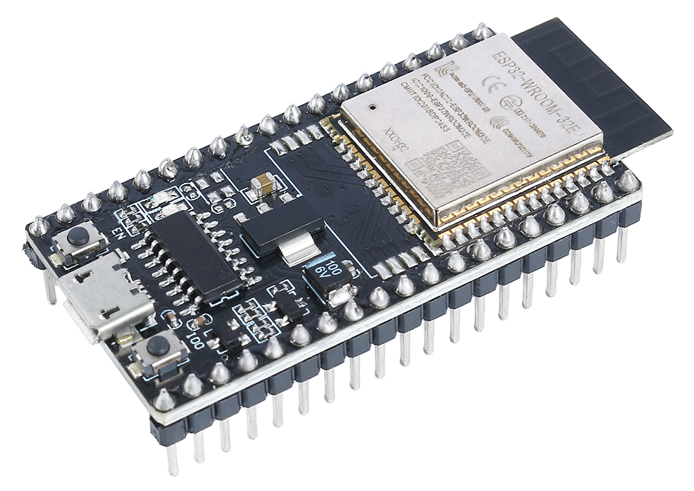
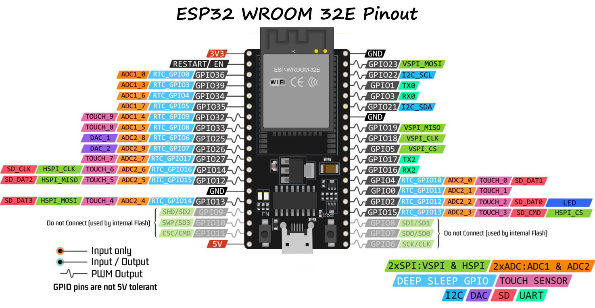
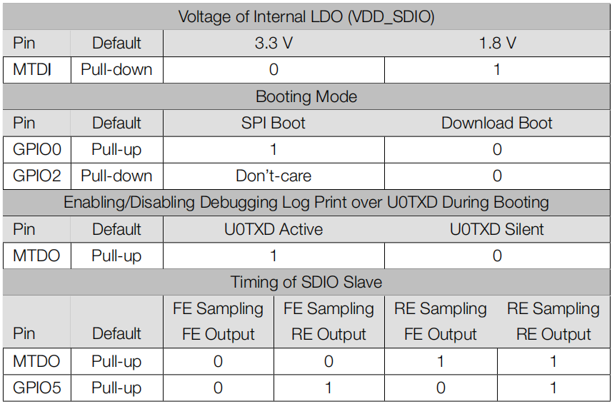

.. note::

    こんにちは、SunFounder Raspberry Pi & Arduino & ESP32 Enthusiasts Communityへようこそ！Facebook上で、仲間と一緒にRaspberry Pi、Arduino、ESP32をさらに深く探求しましょう。

    **なぜ参加するのか？**

    - **専門的なサポート**：購入後の問題や技術的な課題をコミュニティやチームの助けを借りて解決。
    - **学びと共有**：スキルを向上させるためのヒントやチュートリアルを交換。
    - **限定プレビュー**：新製品発表や予告編に早期アクセス。
    - **特別割引**：最新製品の特別割引を楽しむ。
    - **フェスティブプロモーションとプレゼント**：プレゼントやホリデープロモーションに参加。

    👉 私たちと一緒に探索と創造を始める準備はできましたか？[|link_sf_facebook|]をクリックして、今すぐ参加しましょう！
    
.. _cpn_esp32_wroom_32e:

ESP32 WROOM 32E
=================

ESP32 WROOM-32Eは、EspressifのESP32チップセットを中心に構築された多用途で強力なモジュールです。デュアルコアプロセッサ、統合されたWi-FiおよびBluetooth接続を提供し、幅広い周辺インターフェースを備えています。低消費電力で知られており、IoTアプリケーションに最適で、コンパクトな形状でスマートな接続と堅牢なパフォーマンスを実現します。

主な特徴は以下の通りです：

* **処理能力**：デュアルコアのXtensa® 32ビットLX6マイクロプロセッサを搭載し、スケーラビリティと柔軟性を提供します。
* **ワイヤレス機能**：統合された2.4GHz Wi-FiおよびデュアルモードBluetoothを備え、安定したワイヤレス通信を必要とするアプリケーションに最適です。
* **メモリとストレージ**：豊富なSRAMと高性能なフラッシュストレージを備えており、ユーザープログラムやデータストレージのニーズに対応します。
* **GPIO**：最大38本のGPIOピンを提供し、さまざまな外部デバイスやセンサーをサポートします。
* **低消費電力**：複数の省電力モードが利用可能で、バッテリー駆動やエネルギー効率の高いシナリオに最適です。
* **セキュリティ**：統合された暗号化およびセキュリティ機能により、ユーザーデータとプライバシーをしっかりと保護します。
* **多用途性**：シンプルな家庭用電化製品から複雑な産業用機械まで、WROOM-32Eは一貫した効率的なパフォーマンスを提供します。

総じて、ESP32 WROOM-32Eは、強力な処理能力と多様な接続オプションを提供し、IoTおよびスマートデバイス分野での選好される選択肢となっています。

* |link_esp32_datasheet|

.. _esp32_pinout:

ピン配置図
-------------------------

ESP32は、いくつかの機能が特定のピンを共有するため、ピンの使用に制限があります。プロジェクトを設計する際には、ピンの使用を慎重に計画し、潜在的な競合を確認して、適切な動作を確保し、問題を回避することをお勧めします。

以下は、主な制限と考慮事項です：

* **ADC1およびADC2**：WiFiまたはBluetoothがアクティブな場合、ADC2は使用できません。ただし、ADC1は制限なしで使用できます。
* **ブートストラップピン**：GPIO0、GPIO2、GPIO5、GPIO12、およびGPIO15は、ブートプロセス中にブートストラップに使用されます。これらのピンに外部コンポーネントを接続しないように注意してください。
* **JTAGピン**：GPIO12、GPIO13、GPIO14、およびGPIO15は、デバッグ目的でJTAGピンとして使用できます。JTAGデバッグが必要ない場合、これらのピンを通常のGPIOとして使用できます。
* **タッチピン**：一部のピンはタッチ機能をサポートしています。これらのピンをタッチセンシングに使用する場合は注意が必要です。
* **電源ピン**：一部のピンは電源関連の機能に予約されていますので、適切に使用してください。例えば、3V3やGNDなどの電源供給ピンから過剰な電流を引き出さないようにしてください。
* **入力専用ピン**：一部のピンは入力専用であり、出力として使用しないでください。

.. _esp32_strapping:

ストラッピングピン
--------------------------

ESP32には5つのストラッピングピンがあります。

.. list-table::
    :widths: 5 15
    :header-rows: 1

    *   - ストラッピングピン
        - 説明
    *   - IO5
        - デフォルトはプルアップ、IO5とIO15の電圧レベルがSDIOスレーブのタイミングに影響します。
    *   - IO0
        - デフォルトはプルアップ、ローに引かれるとダウンロードモードに入ります。
    *   - IO2
        - デフォルトはプルダウン、IO0とIO2はESP32をダウンロードモードにします。
    *   - IO12(MTDI)
        - デフォルトはプルダウン、ハイに引かれるとESP32は正常にブートできません。
    *   - IO15(MTDO)
        - デフォルトはプルアップ、ローに引かれるとデバッグログが表示されません。さらに、IO5とIO15の電圧レベルがSDIOスレーブのタイミングに影響します。

ソフトウェアはレジスタ "GPIO_STRAPPING" からこれら5つのビットの値を読み取ることができます。チップのシステムリセット解除（電源オンリセット、RTCウォッチドッグリセット、ブラウンアウトリセット）時に、ストラッピングピンのラッチが電圧レベルをサンプリングして "0" または "1" のストラッピングビットとして保持し、チップが電源オフまたはシャットダウンするまでこれらのビットを保持します。ストラッピングビットは、デバイスのブートモード、VDD_SDIOの動作電圧、およびその他の初期システム設定を構成します。

各ストラッピングピンは、チップリセット中に内部プルアップ/プルダウンに接続されます。そのため、ストラッピングピンが未接続または接続された外部回路が高インピーダンスの場合、内部の弱いプルアップ/プルダウンがストラッピングピンのデフォルト入力レベルを決定します。

ストラッピングビットの値を変更するには、外部プルダウン/プルアップ抵抗を適用するか、電源投入時にホストMCUのGPIOを使用してこれらのピンの電圧レベルを制御します。

リセット解除後、ストラッピングピンは通常の機能ピンとして動作します。
以下の表でストラッピングピンによる詳細なブートモード構成を参照してください。

* FE: 下降エッジ、RE: 上昇エッジ
* ファームウェアは、起動後に "内部LDOの電圧（VDD_SDIO）" および "SDIOスレーブのタイミング" の設定を変更するためのレジスタビットを構成できます。
* モジュールには3.3VのSPIフラッシュが統合されているため、モジュールの電源投入時にピンMTDIを1に設定することはできません。
