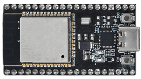
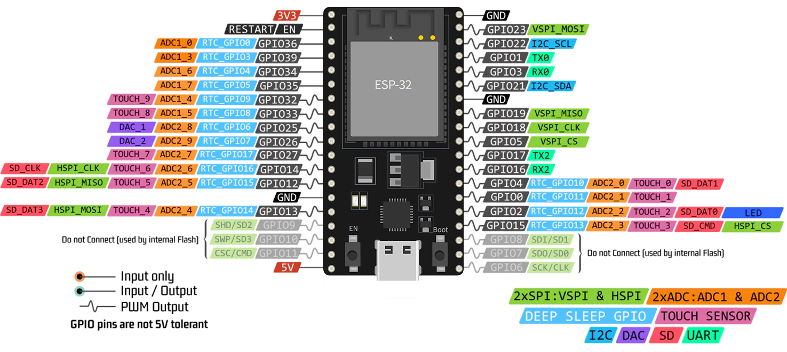
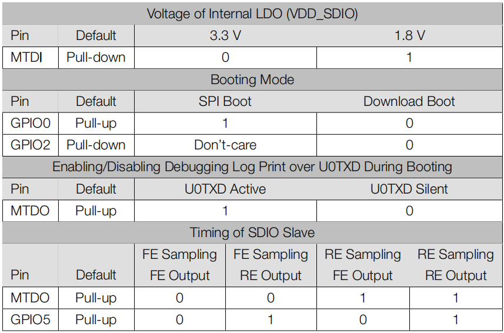

.. note:: 

   Ciao, benvenuti nella Community di appassionati di SunFounder Raspberry Pi, Arduino & ESP32 su Facebook! Approfondisci la tua conoscenza su Raspberry Pi, Arduino e ESP32 insieme ad altri appassionati.

   **Perché unirsi?**

   - **Supporto Esperto**: Risolvi problemi post-vendita e sfide tecniche con l'aiuto della nostra community e del nostro team.
   - **Impara e Condividi**: Scambia consigli e tutorial per migliorare le tue competenze.
   - **Anteprime Esclusive**: Accedi in anteprima alle nuove annunci di prodotti e anteprime.
   - **Sconti Speciali**: Goditi sconti esclusivi sui nostri prodotti più recenti.
   - **Promozioni Festive e Giveaway**: Partecipa ai giveaway e alle promozioni festive.

   👉 Pronto per esplorare e creare con noi? Clicca [|link_sf_facebook|] e unisciti oggi!

.. _cpn_esp32_wroom_32e:

Scheda ESP32
=================

L’ESP32 è un microcontrollore potente e versatile, dotato di elaborazione dual-core, Wi-Fi e Bluetooth integrati e un ampio supporto per periferiche. Grazie al suo design a basso consumo energetico, è particolarmente adatto ad applicazioni IoT compatte e ad alte prestazioni.

Caratteristiche principali:

* **Potenza di elaborazione**: è equipaggiato con un microprocessore Xtensa® LX6 dual-core a 32 bit, che offre grande flessibilità e scalabilità.
* **Connettività wireless**: grazie al Wi-Fi a 2,4 GHz integrato e al Bluetooth dual-mode, è ideale per applicazioni che richiedono comunicazioni wireless stabili.
* **Memoria e archiviazione**: dispone di ampia SRAM e memoria flash ad alte prestazioni per gestire programmi utente e archiviazione dati.
* **GPIO**: con fino a 38 pin GPIO, supporta numerosi sensori e dispositivi esterni.
* **Basso consumo energetico**: offre diverse modalità di risparmio energetico, ideali per dispositivi alimentati a batteria o applicazioni a basso consumo.
* **Sicurezza**: le funzionalità integrate di crittografia e sicurezza proteggono efficacemente i dati e la privacy degli utenti.
* **Versatilità**: dagli elettrodomestici alle applicazioni industriali più complesse, la scheda garantisce prestazioni affidabili ed efficienti.

In sintesi, la scheda ESP32 non offre soltanto elevate capacità di elaborazione e numerose opzioni di connettività, ma anche una vasta gamma di funzionalità che la rendono una scelta ideale per il settore IoT e i dispositivi intelligenti.

.. * |link_esp32_datasheet|

.. _esp32_pinout:

Schema dei pin
-------------------------

L’ESP32 presenta alcune limitazioni nell’utilizzo dei pin, poiché diverse funzionalità condividono gli stessi pin. Durante la progettazione di un progetto, è consigliabile pianificare attentamente l’uso dei pin e verificare eventuali conflitti per garantire il corretto funzionamento ed evitare problemi.

Di seguito sono riportate alcune delle principali limitazioni e considerazioni:

* **ADC1 e ADC2**: ADC2 non può essere utilizzato quando il Wi-Fi o il Bluetooth sono attivi. ADC1, invece, può essere utilizzato senza restrizioni.
* **Pin di bootstrapping**: GPIO0, GPIO2, GPIO5, GPIO12 e GPIO15 vengono utilizzati durante il processo di avvio. È importante evitare di collegare componenti esterni che possano interferire con il boot.
* **Pin JTAG**: GPIO12, GPIO13, GPIO14 e GPIO15 possono essere utilizzati come pin JTAG per il debug. Se il debug JTAG non è necessario, possono essere usati come normali GPIO.
* **Pin touch**: alcuni pin supportano funzionalità touch. Se si desidera utilizzare il rilevamento tattile, è necessario prestare attenzione al loro impiego.
* **Pin di alimentazione**: alcuni pin sono riservati a funzioni di alimentazione e devono essere utilizzati correttamente. Ad esempio, evitare di assorbire corrente eccessiva dai pin 3V3 e GND.
* **Pin solo ingresso**: alcuni pin supportano esclusivamente segnali di ingresso e non devono essere utilizzati come uscite.

.. _esp32_strapping:

**Pin di strapping**
--------------------------

L’ESP32 dispone di cinque pin di strapping:

.. list-table::
    :widths: 5 15
    :header-rows: 1

    *   - Pin di strapping
        - Descrizione
    *   - IO5
        - Pull-up attivo per impostazione predefinita. Il livello di tensione di IO5 e IO15 influisce sul timing dello SDIO Slave.
    *   - IO0
        - Pull-up attivo per impostazione predefinita. Se portato a livello basso, entra in modalità download.
    *   - IO2
        - Pull-down attivo per impostazione predefinita. IO0 e IO2 insieme fanno entrare l’ESP32 in modalità download.
    *   - IO12(MTDI)
        - Pull-down attivo per impostazione predefinita. Se portato a livello alto, l’ESP32 non si avvierà correttamente.
    *   - IO15(MTDO)
        - Pull-up attivo per impostazione predefinita. Se portato a livello basso, i log di debug non saranno visibili. Inoltre, il livello di tensione di IO5 e IO15 influisce sul timing dello SDIO Slave.

Il software può leggere i valori di questi cinque bit dal registro “GPIO_STRAPPING”.

Durante il rilascio del reset del sistema del chip (power-on reset, reset del watchdog RTC e brownout reset), i latch dei pin di strapping campionano il livello di tensione come bit di configurazione “0” o “1” e mantengono tali valori finché il chip non viene spento o arrestato. Questi bit configurano la modalità di avvio del dispositivo, la tensione operativa di VDD_SDIO e altre impostazioni iniziali del sistema.

Ogni pin di strapping è collegato internamente a una resistenza di pull-up o pull-down durante il reset del chip. Di conseguenza, se un pin di strapping non è collegato oppure il circuito esterno presenta un’elevata impedenza, il livello logico predefinito sarà determinato dalle resistenze interne.

Per modificare i valori dei bit di strapping, è possibile utilizzare resistenze esterne di pull-up/pull-down oppure controllare il livello logico di questi pin tramite i GPIO del microcontrollore host durante l’accensione dell’ESP32.

Dopo il rilascio del reset, i pin di strapping tornano a funzionare come normali GPIO.
Fare riferimento alla tabella seguente per una configurazione dettagliata delle modalità di avvio tramite i pin di strapping.

* FE: fronte di discesa, RE: fronte di salita
* Il firmware può configurare i registri dopo l’avvio per modificare le impostazioni relative a “Voltage of Internal LDO (VDD_SDIO)” e “Timing of SDIO Slave”.
* Il modulo integra una memoria flash SPI da 3,3 V; pertanto il pin MTDI non deve essere impostato a livello alto durante l’accensione del modulo.
