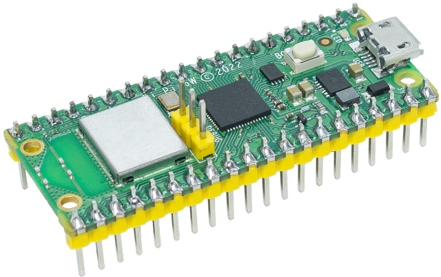

.. note::

   Hallo und willkommen in der SunFounder Raspberry Pi & Arduino & ESP32 Enthusiasten-Gemeinschaft auf Facebook! Tauchen Sie tiefer ein in die Welt von Raspberry Pi, Arduino und ESP32 mit anderen Enthusiasten.

   **Warum beitreten?**

   - **Expertenunterstützung**: Lösen Sie Nachverkaufsprobleme und technische Herausforderungen mit Hilfe unserer Gemeinschaft und unseres Teams.
   - **Lernen & Teilen**: Tauschen Sie Tipps und Anleitungen aus, um Ihre Fähigkeiten zu verbessern.
   - **Exklusive Vorschauen**: Erhalten Sie frühzeitigen Zugang zu neuen Produktankündigungen und exklusiven Einblicken.
   - **Spezialrabatte**: Genießen Sie exklusive Rabatte auf unsere neuesten Produkte.
   - **Festliche Aktionen und Gewinnspiele**: Nehmen Sie an Gewinnspielen und Feiertagsaktionen teil.

   👉 Sind Sie bereit, mit uns zu erkunden und zu erschaffen? Klicken Sie auf [|link_sf_facebook|] und treten Sie heute bei!

.. _cpn_pico_w:

Raspberry Pi Pico W
=======================================

Der Raspberry Pi Pico W erweitert die meistverkaufte Raspberry Pi Pico Produktlinie um drahtlose Konnektivität. Basierend auf unserer RP2040-Siliziumplattform bieten Pico-Produkte unsere charakteristischen Werte von hoher Leistung, niedrigen Kosten und Benutzerfreundlichkeit im Mikrocontroller-Bereich.

Der Raspberry Pi Pico W unterstützt 2,4 GHz 802.11 b/g/n Wireless LAN mit einer eingebauten Antenne und modularem Konformitätszertifikat. Er kann sowohl im Station- als auch im Access-Point-Modus betrieben werden. Volle Netzwerkfunktionalität steht sowohl C- als auch MicroPython-Entwicklern zur Verfügung.

Der Raspberry Pi Pico W kombiniert den RP2040 mit 2 MB Flash-Speicher und einem Stromversorgungs-Chip, der Eingangsspannungen von 1,8 bis 5,5 V unterstützt. Er bietet 26 GPIO-Pins, von denen drei als analoge Eingänge fungieren können, auf 0,1"-Lötaugen mit gestuften Kanten.
Der Raspberry Pi Pico W ist als Einzelstück oder in Rollen mit 480 Einheiten für die automatische Montage erhältlich.

Funktionen
--------------

* 21 mm x 51 mm Formfaktor
* RP2040 Mikrocontroller-Chip, entwickelt von Raspberry Pi in Großbritannien
* Dual-Core Arm Cortex-M0+ Prozessor, flexibler Takt bis zu 133 MHz
* 264 kB On-Chip-SRAM
* 2 MB On-Board QSPI-Flash
* 2,4 GHz 802.11n Wireless LAN
* 26 multifunktionale GPIO-Pins, darunter 3 analoge Eingänge
* 2 x UART, 2 x SPI-Controller, 2 x I2C-Controller, 16 x PWM-Kanäle
* 1 x USB 1.1 Controller und PHY, mit Host- und Geräteunterstützung
* 8 x Programmierbare I/O (PIO) Zustandsmaschinen für benutzerdefinierte Peripherieunterstützung
* Unterstützte Eingangsspannung 1,8-5,5 V DC
* Betriebstemperatur -20°C bis +70°C
* Modul mit gestuften Kanten ermöglicht das direkte Löten auf Trägerplatinen
* Drag-and-Drop-Programmierung über Massenspeicher-USB
* Energiesparender Schlaf- und Ruhezustand
* Präzise On-Chip-Uhr
* Temperatursensor
* Beschleunigte Ganzzahl- und Gleitkomma-Bibliotheken On-Chip

Pins des Pico
------------------

.. image:: img/pico_pin.jpg
    :width: 100%
    :align: center

.. raw:: html

     

.. list-table::
    :widths: 3 5 10
    :header-rows: 1

    *   - Name
        - Beschreibung
        - Funktion
    *   - GP0-GP28
        - Allgemeine Eingangs-/Ausgangspins
        - Dienen entweder als Eingang oder Ausgang und haben keine feste eigene Funktion.
    *   - GND
        - 0 Volt Masse
        - Mehrere GND-Pins rund um den Pico W erleichtern die Verdrahtung.
    *   - RUN
        - Aktiviert oder deaktiviert Ihren Pico
        - Starten und stoppen Sie Ihren Pico W von einem anderen Mikrocontroller.
    *   - GPxx_ADCx
        - Allgemeine Eingangs-/Ausgangspins oder analoge Eingänge
        - Wird sowohl als analoger Eingang als auch als digitaler Eingang oder Ausgang verwendet – jedoch nicht gleichzeitig.
    *   - ADC_VREF
        - Analog-Digital-Wandler (ADC) Spannungsreferenz
        - Ein spezieller Eingangspin, der eine Referenzspannung für analoge Eingänge setzt.
    *   - AGND
        - Analog-Digital-Wandler (ADC) 0 Volt Masse
        - Eine spezielle Masseverbindung für den Einsatz mit dem ADC_VREF-Pin.
    *   - 3V3(O)
        - 3,3 Volt Stromversorgung
        - Eine 3,3 V Stromquelle, die gleiche Spannung, mit der Ihr Pico W intern betrieben wird, erzeugt aus dem VSYS-Eingang.
    *   - 3v3(E)
        - Aktiviert oder deaktiviert die Stromversorgung
        - Schaltet die 3V3(O) Stromversorgung ein oder aus, kann auch Ihren Pico W ausschalten.
    *   - VSYS
        - 2-5 Volt Stromversorgung
        - Ein Pin, der direkt mit der internen Stromversorgung Ihres Pico verbunden ist, und der nicht ausgeschaltet werden kann, ohne den Pico W auszuschalten.
    *   - VBUS
        - 5 Volt Stromversorgung
        - Eine 5 V Stromquelle, die vom Micro-USB-Port Ihres Pico entnommen wird und Hardware versorgt, die mehr als 3,3 V benötigt.

Der beste Ort, um alles zu finden, was Sie für den Einstieg mit Ihrem Raspberry Pi Pico W benötigen, ist `hier <https://www.raspberrypi.com/documentation/microcontrollers/raspberry-pi-pico.html>`_.

Oder klicken Sie auf die folgenden Links: 

* `Raspberry Pi Pico W product brief <https://datasheets.raspberrypi.com/picow/pico-w-product-brief.pdf>`_
* `Raspberry Pi Pico W datasheet <https://datasheets.raspberrypi.com/picow/pico-w-datasheet.pdf>`_
* `Getting started with Raspberry Pi Pico: C/C++ development <https://datasheets.raspberrypi.org/pico/getting-started-with-pico.pdf>`_
* `Raspberry Pi Pico C/C++ SDK <https://datasheets.raspberrypi.org/pico/raspberry-pi-pico-c-sdk.pdf>`_
* `API-level Doxygen documentation for the Raspberry Pi Pico C/C++ SDK <https://raspberrypi.github.io/pico-sdk-doxygen/>`_
* `Raspberry Pi Pico Python SDK <https://datasheets.raspberrypi.org/pico/raspberry-pi-pico-python-sdk.pdf>`_
* `Raspberry Pi RP2040 datasheet <https://datasheets.raspberrypi.org/rp2040/rp2040-datasheet.pdf>`_
* `Hardware design with RP2040 <https://datasheets.raspberrypi.org/rp2040/hardware-design-with-rp2040.pdf>`_
* `Raspberry Pi Pico W design files <https://datasheets.raspberrypi.com/picow/RPi-PicoW-PUBLIC-20220607.zip>`_
* `Raspberry Pi Pico W STEP file <https://datasheets.raspberrypi.com/picow/PicoW-step.zip>`_