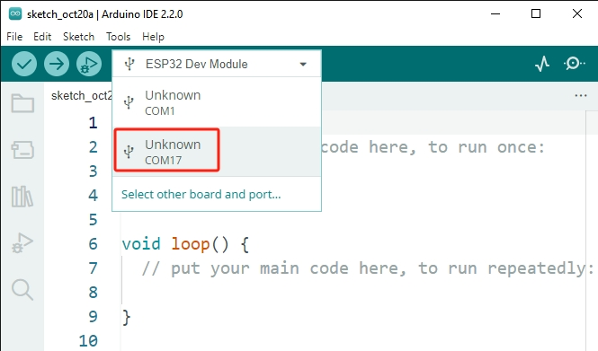

.. _unknown_com_port:

Always displaying "Unknown COMxx"?
-------------------------------------------

When plugging the ESP32 into the computer, the Arduino IDE often displays ``Unknown COMxx``. Why does this happen?

This is because the USB driver for ESP32 is different from the regular Arduino Boards. The Arduino IDE can't automatically recognize this board. 

In such a scenario, you need to manually select the correct board by following these steps:

#. Click on **"Select the other board and port"**.

    .. image:: img/unknown_select.png

#. In the search, type **"esp32 dev module"**, then select the board that appears. Afterward, select the correct port and click **OK**.

    .. image:: img/unknown_board.png

#. Now, you should be able to see your board and port in this quick view window.

    .. image:: img/unknown_correct.png