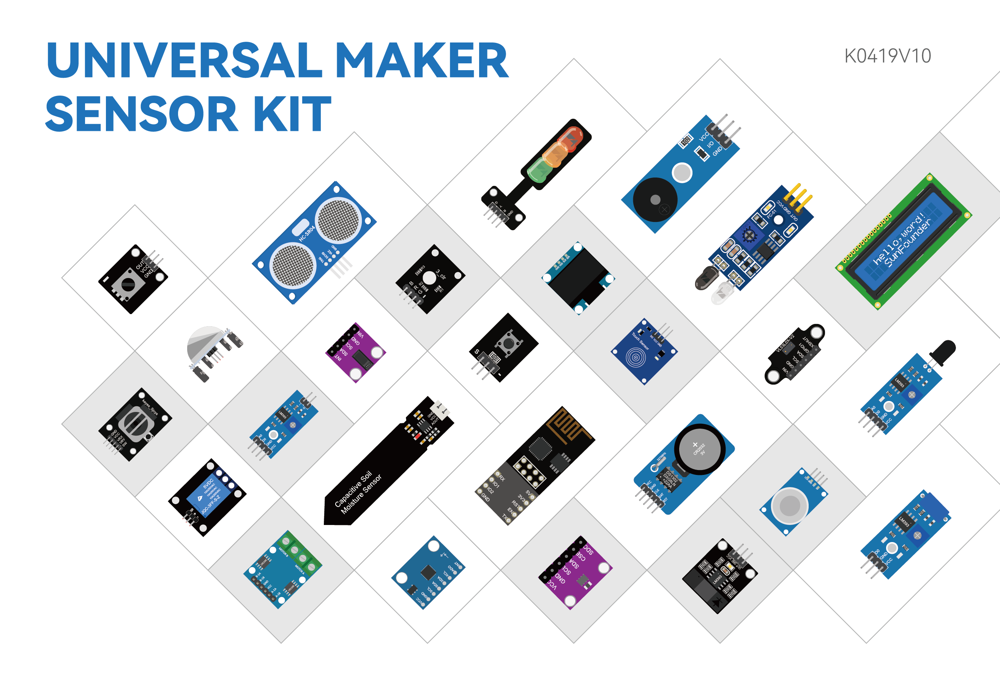

.. note::

    こんにちは、SunFounder Raspberry Pi & Arduino & ESP32 Enthusiasts Communityへようこそ！Facebook上で、仲間と一緒にRaspberry Pi、Arduino、ESP32をさらに深く探求しましょう。

     **なぜ参加するのか？** 

    - **専門的なサポート**：購入後の問題や技術的な課題をコミュニティやチームの助けを借りて解決。
    - **学びと共有**：スキルを向上させるためのヒントやチュートリアルを交換。
    - **限定プレビュー**：新製品発表や予告編に早期アクセス。
    - **特別割引**：最新製品の特別割引を楽しむ。
    - **フェスティブプロモーションとプレゼント**：プレゼントやホリデープロモーションに参加。

    👉 私たちと一緒に探索と創造を始める準備はできましたか？[|link_sf_facebook|]をクリックして、今すぐ参加しましょう！

ユニバーサルメーカーセンサーキット
==================================================

このたびは、弊社のユニバーサルメーカーセンサーキットをお選びいただき、ありがとうございます。

 .. note::
    このドキュメントは以下の言語で利用できます。

        * |link_german_tutorials|
        * |link_jp_tutorials|
        * |link_en_tutorials|

    ご希望の言語のリンクをクリックして、ドキュメントにアクセスしてください。

オンラインで電子キットを注文したことはありますか？しかし、それに付属していたのは、プロジェクトの潜在能力を十分に引き出せない基本的なPDFや限定された冊子だけだったことはありませんか？または、スマートデバイスを自作したいけれど、利用可能なキットの複雑さや高コストに圧倒されたことはありませんか？他の人が作成した高度なプロジェクトに感心しながら、どこから始めればよいのかわからなかったことはありませんか？

そんなあなたに「ユニバーサルメーカーセンサーキット」をご紹介します。これまでの課題をすべて解決し、最新の電子工学をマスターするためのゲートウェイです。

ユニバーサルメーカーセンサーキットには、基本的なブレッドボードから、火炎検知器、ガスセンサーなどの高度なセンサーまで、合計25種類以上のセンサー、アクチュエーター、ディスプレイモジュールが含まれています。各コンポーネントには、Arduino Uno、ESP32モジュール、Raspberry Pi Pico、およびRaspberry Piをサポートする簡単に従えるチュートリアルが付属しており、学習の旅をスムーズで魅力的なものにします。

このキットは、Arduino UNOシリーズの最新モデルUNO R4と、最新のRaspberry Pi 5をサポートしており、技術の最前線に立つことができます。初心者から経験豊富なメーカーまで、最先端のコンポーネントを通じてスキルを向上させることができます。

このキットは、単なる部品の組み立てではなく、創造性を解き放つためのものです。独自のコードを書き、ユニークなプロジェクトを開発し、各コンポーネントの詳細を理解する方法を学びます。初心者から経験豊富なメーカーまで、電子工学のスキルを高めるために特別に設計されたキットです。

初めての方のために、プログラミングと電子工学の世界に簡単に入門できる一連の魅力的なプロジェクトも提供しています。初心者からエキスパートまでの知識と自信を身につけ、スマートデバイスや電子プロジェクトを自作できるようになります。

今日からユニバーサルメーカーセンサーキットで電子革新の世界に飛び込みましょう。アイデアを現実に変え、電子工学とプログラミングの分野でゼロからヒーローへと進化しましょう！

ご質問やその他の興味深いアイデアがある場合は、service@sunfounder.comまでお気軽にメールしてください。

.. * :ref:`表示言語について`

* :ref:`目次`

* :ref:`著作権表示`

.. 表示言語について
.. --------------------------------

.. note::

..    英語に加えて、他の言語でもこのコースを提供する予定です。
..   ご協力いただける方は、service@sunfounder.comまでご連絡ください。
..    無料の製品をお送りします。

..現在、オンラインチュートリアルは英語、ドイツ語、日本語をサポートしています。ページの左下隅にある**Read the Docs**アイコンをクリックして表示言語を変更してください。

.. .. image:: img/translation.png
..    :align: center

.. .. raw:: html

..     

目次
--------------------------------

.. toctree:: 
    :maxdepth: 2

    ユニバーサルメーカーセンサーキットについて <self>
    download_code
    01_components_basic/00-component_list
    02_arduino/arduino
    03_esp32/esp32
    04_pi_pico/pi_pico
    05_raspberry_pi/raspberry_pi
    06_faq/00_faq
    07_appendix/appendix
    thank-learning

著作権表示
-----------------------

このマニュアルのテキスト、画像、コードなどのすべての内容は、SunFounder Companyに帰属します。関連する規制および著作権法の下で、著者および関連権利者の法的権利を侵害することなく、個人の学習、調査、楽しみ、またはその他の非商業的または非営利的な目的でのみ使用する必要があります。許可なく商業的利益のためにこれらを使用する個人または組織に対して、会社は法的措置を取る権利を留保します。
