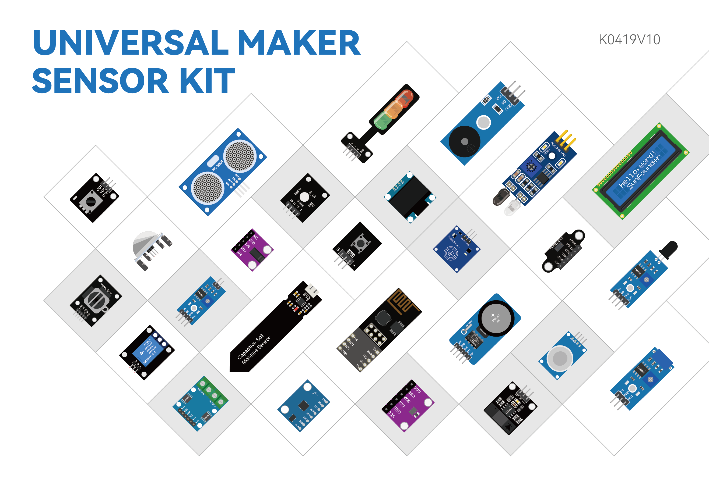

.. note:: 
    Bonjour, bienvenue dans la communauté des passionnés de SunFounder Raspberry Pi, Arduino et ESP32 sur Facebook ! Plongez plus profondément dans les univers de Raspberry Pi, Arduino et ESP32 avec d'autres enthousiastes.

    **Pourquoi rejoindre ?**

    - **Support d'expert** : Résolvez les problèmes après-vente et les défis techniques avec l'aide de notre communauté et de notre équipe.
    - **Apprendre et partager** : Échangez des astuces et des tutoriels pour améliorer vos compétences.
    - **Aperçus exclusifs** : Accédez en avant-première aux annonces de nouveaux produits et aux aperçus.
    - **Réductions spéciales** : Profitez de réductions exclusives sur nos nouveaux produits.
    - **Promotions festives et cadeaux** : Participez à des cadeaux et des promotions festives.

    👉 Prêts à explorer et créer avec nous ? Cliquez sur [|link_sf_facebook|] et rejoignez-nous aujourd'hui !

|link_Universal_kit|
==================================================

* |link_Universal_Maker_Sensor_Kit|

Merci d'avoir choisi notre |link_Universal_kit|.

 .. note::
     Ce document est disponible dans les langues suivantes.

         * |link_german_tutorials|
         * |link_jp_tutorials|
         * |link_en_tutorials|
         * |link_fr_tutorials|
         * |link_es_tutorials|
         * |link_it_tutorials|
    
     Veuillez cliquer sur les liens respectifs pour accéder au document dans votre langue préférée.

Avez-vous déjà commandé un kit électronique en ligne, pour découvrir qu'il était accompagné d'un PDF de base ou d'un livret limité qui effleure à peine le potentiel de votre projet ? Ou êtes-vous désireux de construire vos propres dispositifs intelligents mais vous vous sentez intimidé par la complexité et les coûts élevés des kits disponibles ? Peut-être avez-vous admiré les projets avancés créés par d'autres mais ne saviez pas par où commencer ?

Nous vous présentons notre "Kit de capteurs universel pour créateurs" – la solution à tous ces défis et la porte d'entrée pour maîtriser l'électronique moderne.

Dans le Kit de capteurs universel pour créateurs, vous trouverez une gamme étendue de composants, des plaques d'essai basiques aux capteurs complexes comme les détecteurs de flamme, les capteurs de gaz, et bien plus encore – plus de 25 capteurs, actionneurs et modules d'affichage au total. Chaque composant est accompagné d'un tutoriel facile à suivre, compatible avec Arduino Uno, les modules ESP32, Raspberry Pi Pico et Raspberry Pi, rendant votre parcours d'apprentissage fluide et engageant.

Notre kit prend fièrement en charge les dernières nouveautés de la série Arduino UNO, l'UNO R4, ainsi que la dernière sortie de Raspberry Pi, le Raspberry Pi 5, vous garantissant de rester à la pointe des avancées technologiques. Que vous soyez débutant ou un créateur expérimenté, notre kit peut améliorer vos compétences grâce à des composants de pointe.

Ce kit ne consiste pas seulement à assembler des pièces ; il s'agit de libérer votre créativité. Vous apprendrez à écrire votre propre code, à développer des projets uniques, et à comprendre les subtilités de chaque composant. Que vous soyez débutant ou un créateur expérimenté, notre kit est conçu pour élever vos compétences en électronique.

Et pour ceux qui débutent, nous proposons une gamme de projets captivants, parfaits pour se lancer dans le monde de la programmation et de l'électronique. Vous acquerrez les connaissances et la confiance nécessaires pour passer d'un débutant à un expert, en créant vos propres dispositifs intelligents et projets électroniques.

Embrassez le monde de l'innovation électronique aujourd'hui avec notre Kit de capteurs universel pour créateurs. Transformez vos idées en réalité, et évoluez de zéro à héros dans le domaine de l'électronique et de la programmation !

Si vous avez des questions ou d'autres idées intéressantes, n'hésitez pas à nous envoyer un courriel à service@sunfounder.com.

Table des matières
--------------------------------

.. toctree:: 
    :maxdepth: 2

    About Universal Maker Sensor Kit <self>
    download_code
    01_components_basic/00-component_list
    02_arduino/arduino
    03_esp32/esp32
    04_pi_pico/pi_pico
    05_raspberry_pi/raspberry_pi
    06_faq/00_faq
    07_appendix/appendix
    thank-learning

Notice de droit d'auteur
---------------------------

Tous les contenus, y compris mais sans s'y limiter, les textes, images, et codes dans ce manuel sont la propriété de la société SunFounder. Vous devez uniquement les utiliser à des fins d'étude personnelle, de recherche, de divertissement, ou d'autres buts non commerciaux ou à but non lucratif, en respectant les réglementations et lois sur le droit d'auteur, sans porter atteinte aux droits légaux de l'auteur et des détenteurs de droits pertinents. Pour toute personne ou organisation utilisant ces contenus à des fins de profit commercial sans autorisation, la société se réserve le droit de prendre des mesures légales.
